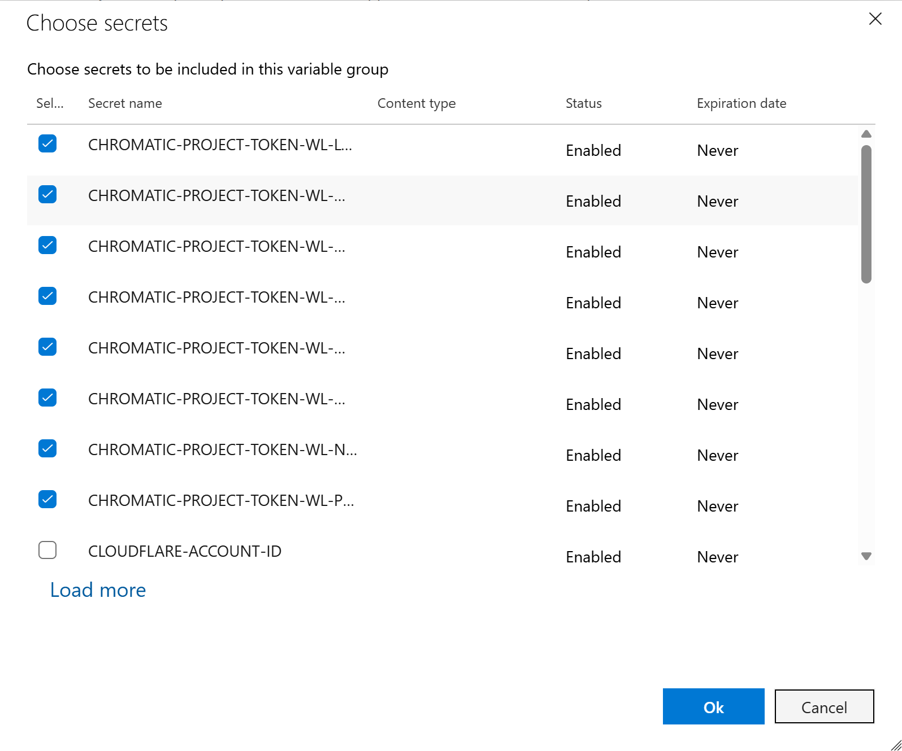

# Add secrets to Keeper

At Workleap, most pipeline secrets are centralized in [Keeper](https://www.keepersecurity.com/) to simplify management and ensure smooth rotation when values expire. This guide explains how to add a new secret to Keeper so it can be securely used in a Chromatic pipeline.

To add a new pipeline secret to Keeper, follow those steps :point_down:

## Create the secrets in Keeper

1. To access production secrets in Keeper, request PIM access to the Keeper **production group** associated to your product or pipeline.
2. Go to Keeper Secret Manager.
3. Create the secrets in the folder associated to your product or pipeline.
4. Configure the Slack channel for expiration alerts (it's a field in Keeper).
5. Note down the UID of the secrets generated by Keeper.

!!!warning
Use dashes (`-`) and not underscores (`_`) in the secrets name (Azure key vault does not support underscores)
!!!

## Update Terraform

6. Open a PR in the [production Terraform repository](https://github.com/workleap/wl-terraform-wlplatform/blob/main/workleap/live/prod/foundation/main.tf).
7. Add the secrets declaration with the Keeper UID in the module `pipeline-secrets`.

## Apply Terraform changes

8. Once the PR is merged, trigger a run in Terraform Cloud:
    - Production: [workspace wl-prod-foundation](https://app.terraform.io/app/Workleap/workspaces/wl-prod-foundation)

## Create the ADO variable group

!!!warning
A variable group cannot be hybrid (reference key vault and have hardcoded variables).
!!!

9. Create a new [variable group](https://learn.microsoft.com/en-us/azure/devops/pipelines/process/set-secret-variables?view=azure-devops&tabs=yaml%2Cbash#set-a-secret-variable-in-a-variable-group) or use an existing one.

10. If a new variable group is created:
    - Toggle the `Link secrets from an Azure key vault as a variable` switch.
    - Set a value for `Azure subscription` and `Key vault name`.

:::align-image-left
{width=841 height=578}
:::

11. Add new variables to the group by selecting the secrets created earlier in Terraform.

:::align-image-left
{width=798 height=665}
:::

## Update the ADO pipeline

12. Modify the pipelines to:
    - Reference the variable group created in the previous steps (or an existing one).
    - Use the variables of the secrets added in the previous steps.

```yaml !#2,4,12,13 chromatic.yml
variables:
  - group: Chromatic-kv

pool: workleap

steps:
  - task: CmdLine@2
    displayName: Chromatic
    inputs:
      script: pnpm dlx @workleap/chromado
    env:
      CHROMATIC_PROJECT_TOKEN: $(CHROMATIC-PROJECT-TOKEN-WL-NAVBAR)
      CHROMATIC_PULL_REQUEST_COMMENT_ACCESS_TOKEN: $(PULL-REQUEST-COMMENT-ACCESS-TOKEN)
      CHROMATIC_DEBUG: true
```

!!!warning
Ensure the pipeline run on private agents (mandatory to access the key vault).
!!!

## Key point to remember

- :white_check_mark: Always use dashes (`-`) in names
- :white_check_mark: Configure the correct Slack channel for alerts
- :white_check_mark: A Terraform PR is mandatory for each new secret
- :white_check_mark: Pipelines must run on private agents to access the Key Vault
- :white_check_mark: A variable group cannot be hybrid (reference key vault and have hardcoded variables)

## Additional resources

- [Migration generation pipeline](https://workleap.atlassian.net/wiki/spaces/TL/pages/5711921209/Migration+Automation#Step-1%3A-Use-the-Migration-Generation-Pipeline)
